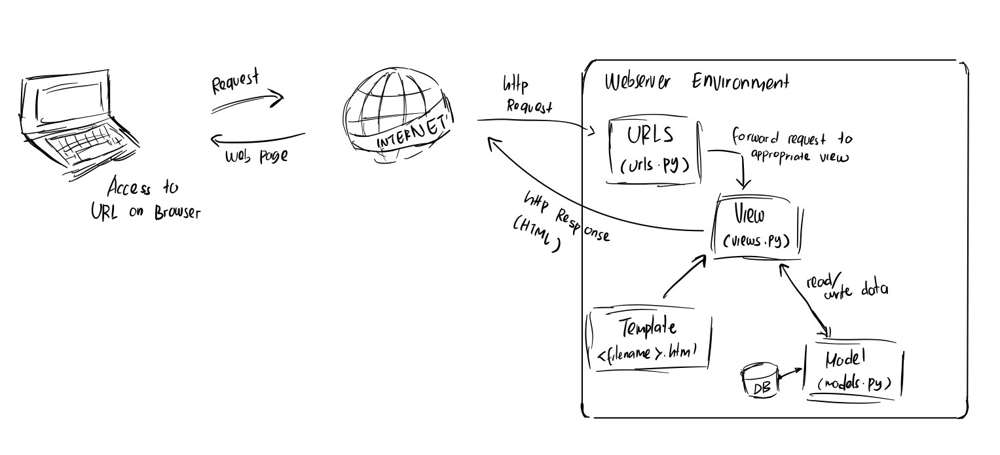

Jelaskan bagaimana cara kamu mengimplementasikan checklist di atas secara step-by-step (bukan hanya sekadar mengikuti tutorial).
=> 
Membuat sebuah proyek Django baru.

Membuat aplikasi dengan nama main pada proyek tersebut.

Melakukan routing pada proyek agar dapat menjalankan aplikasi main.

Membuat model pada aplikasi main dengan nama Product dan memiliki atribut wajib sebagai berikut.

Membuat sebuah fungsi pada views.py untuk dikembalikan ke dalam sebuah template HTML yang menampilkan nama aplikasi serta nama dan kelas kamu.

Membuat sebuah routing pada urls.py aplikasi main untuk memetakan fungsi yang telah dibuat pada views.py.

Melakukan deployment ke PWS terhadap aplikasi yang sudah dibuat sehingga nantinya dapat diakses oleh teman-temanmu melalui Internet.

=> 

HTTP Request yang dikirim oleh pengguna diterima oleh urls.py, yang bertugas mencocokkan URL dengan fungsi yang sesuai di views.py. Views.py memproses request tersebut dengan membaca atau menulis data melalui models.py, yang mewakili tabel di database menggunakan ORM. Setelah memproses data, views.py akan menggabungkannya dengan template HTML dan mengirimkan respons yang sesuai kepada pengguna.

Jelaskan fungsi git dalam pengembangan perangkat lunak!
=> Git memiliki banyak sekali fungsi dalam pengembangan perangkat lunak. Menurut saya, salah satu fitur yang sangat krusial adalah Git memungkinkan banyak developer untuk bekerja pada proyek yang sama secara paralel, tanpa risiko menimpa pekerjaan satu sama lain. Hal ini dapat terjadi dikarenakan setiap orang dapat membuat cabang (branch) yang terpisah, dan kemudian menggabungkannya (merge) ke cabang utama. Selain itu, Git juga menyimpan setiap perubahan dan versi dari kode yang kita buat, sehingga memudahkan jika perlu melakukan penyelesaian konflik.

Menurut Anda, dari semua framework yang ada, mengapa framework Django dijadikan permulaan pembelajaran pengembangan perangkat lunak?
=> Django dapat dijadikan pilihan awal yang bagus untuk permulaan pembelajaran pengembangan perangkat lunak karena mudah dipahami dan punya dokumentasi lengkap. Framework ini menawarkan banyak fitur bawaan, seperti autentikasi pengguna, manajemen database, dan admin panel, sehingga pemula bisa langsung fokus pada pengembangan tanpa banyak konfigurasi. Dengan pola MVC, Django juga membantu pemula memahami struktur kode yang rapi dan terorganisir. Komunitasnya yang besar menyediakan banyak bantuan, dan Django punya fitur keamanan bawaan untuk melindungi aplikasi dari ancaman umum. Selain itu, Django digunakan oleh aplikasi besar, sehingga apa yang dipelajari bisa langsung diterapkan di proyek nyata.

Mengapa model pada Django disebut sebagai ORM?
=> Model pada Django disebut sebagai ORM (Object-Relational Mapping) karena Django menggunakan teknik ORM untuk menghubungkan antara model Python dan database. ORM memungkinkan developer untuk bekerja dengan database menggunakan objek Python, tanpa harus menulis query SQL secara langsung. Dengan ORM, setiap tabel di database direpresentasikan sebagai sebuah class di Python (model), dan setiap baris di tabel tersebut menjadi instance dari class itu. Django ORM secara otomatis menerjemahkan operasi pada objek model ke dalam operasi SQL yang sesuai, sehingga memudahkan interaksi dengan database tanpa perlu pengetahuan mendalam tentang SQL.