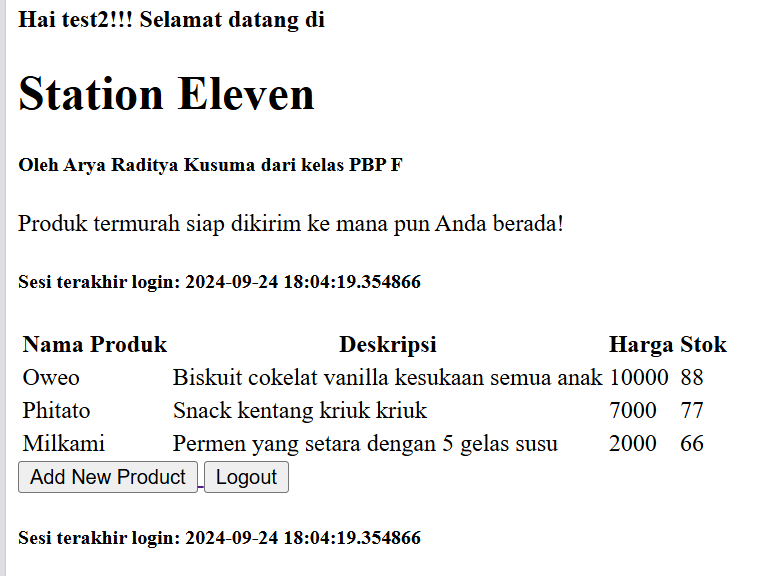
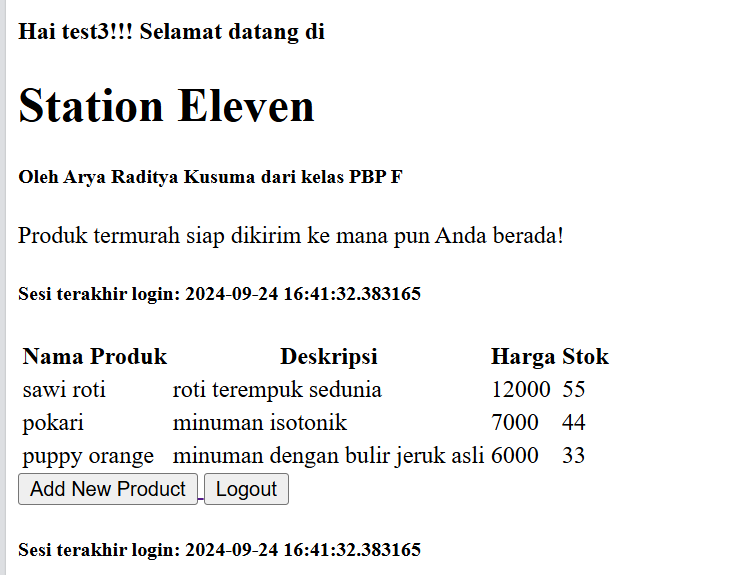
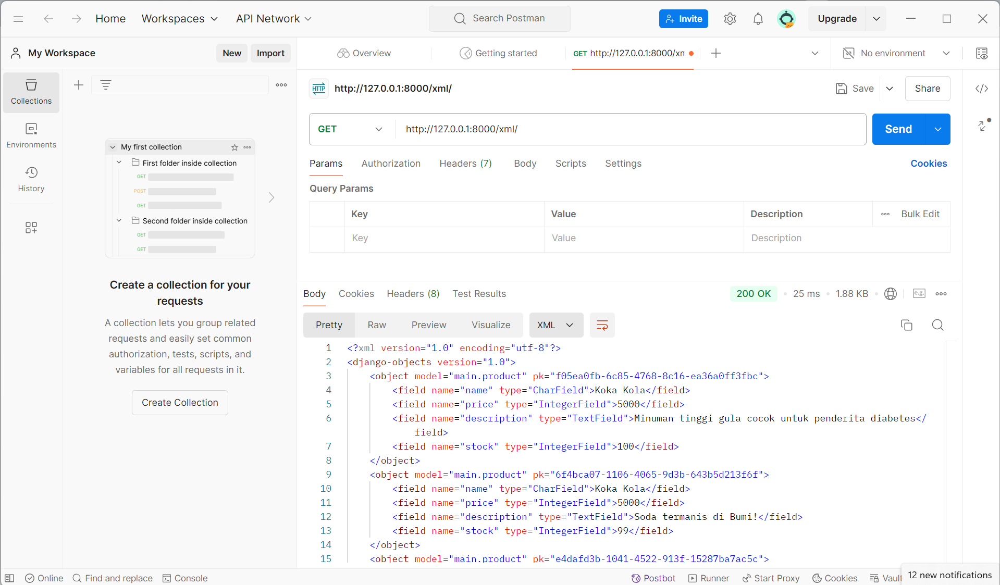
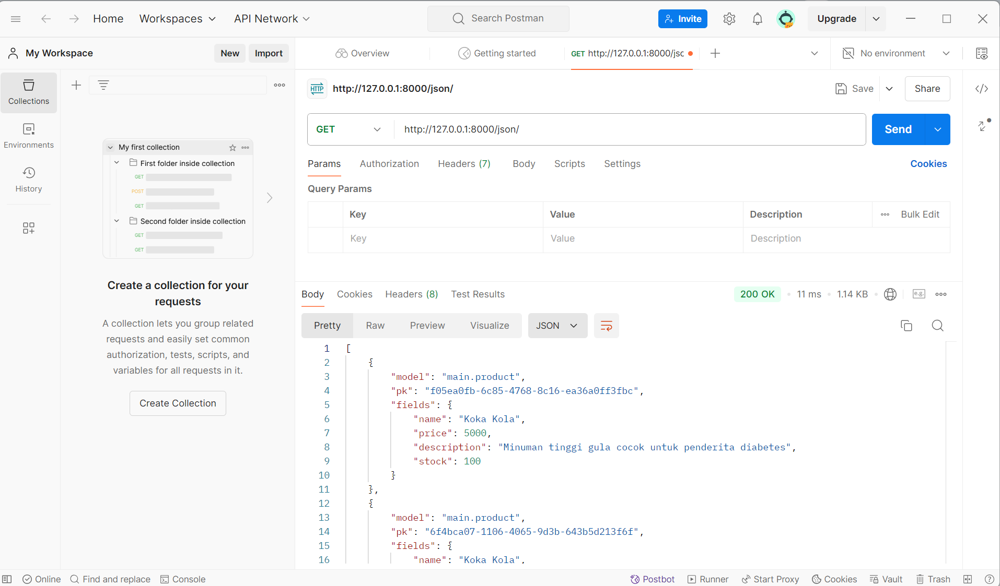
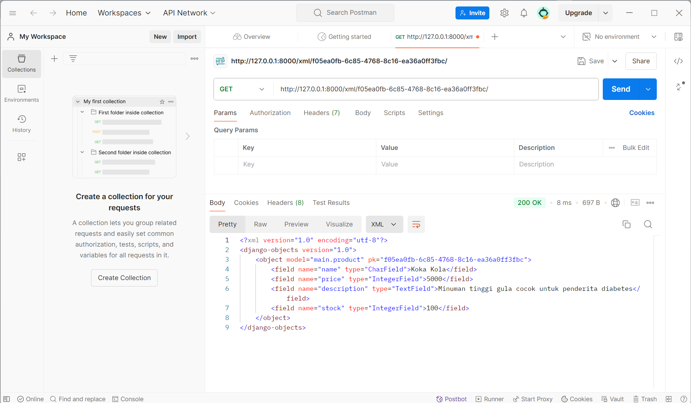
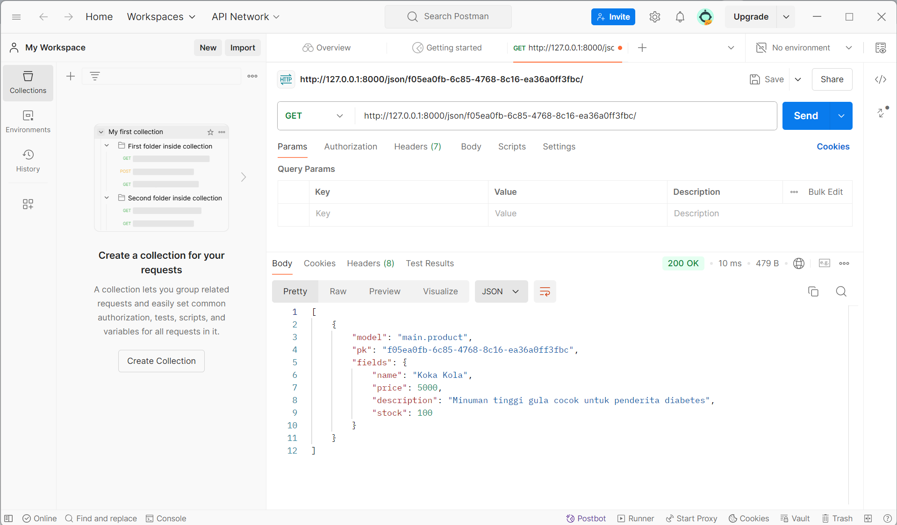

# Tugas Week 6

## Jelaskan manfaat dari penggunaan JavaScript dalam pengembangan aplikasi web!

Penggunaan JavaScript dalam pengembangan aplikasi web sangat bermanfaat karena memungkinkan peningkatan interaktivitas dan performa melalui AJAX (Asynchronous JavaScript and XML), yang memungkinkan aplikasi web berkomunikasi dengan server di latar belakang tanpa memuat ulang halaman. Ini sangat penting untuk fitur real-time seperti pemuatan data dinamis, validasi formulir, atau pembaruan konten secara instan, memberikan pengalaman pengguna yang lebih lancar dan responsif. JavaScript juga terintegrasi dengan baik dengan HTML dan CSS, serta mendukung framework modern untuk membangun aplikasi web yang lebih efisien dan interaktif.

## Jelaskan fungsi dari penggunaan await ketika kita menggunakan fetch()! Apa yang akan terjadi jika kita tidak menggunakan await?

Penggunaan await saat menggunakan fetch() berfungsi untuk menunggu sampai proses pengambilan data (fetching) selesai sebelum melanjutkan eksekusi kode berikutnya. fetch() mengembalikan sebuah Promise, dan dengan await, kita bisa menangkap hasilnya secara langsung setelah permintaan selesai, sehingga menghindari penulisan kode then/catch. Jika kita tidak menggunakan await, kode setelah fetch() akan dieksekusi segera, bahkan sebelum data dari Promise diterima, yang dapat menyebabkan hasil yang tidak diinginkan seperti variabel yang belum terisi dengan benar atau respons yang belum tersedia saat dibutuhkan.

## Mengapa kita perlu menggunakan decorator csrf_exempt pada view yang akan digunakan untuk AJAX POST?

Kita perlu menggunakan decorator csrf_exempt pada view yang akan digunakan untuk AJAX POST karena Django secara default mengaktifkan CSRF (Cross-Site Request Forgery) protection untuk semua permintaan POST. CSRF melindungi aplikasi dari serangan berbahaya dengan memverifikasi bahwa permintaan POST datang dari sumber yang tepercaya (misalnya dari form dalam aplikasi yang sama). Namun, ketika menggunakan AJAX POST, terutama dari sumber eksternal atau tanpa token CSRF yang valid, permintaan akan ditolak oleh Django. Dengan menambahkan csrf_exempt, kita secara eksplisit mengabaikan verifikasi CSRF untuk view tersebut, memungkinkan AJAX POST berjalan tanpa harus menyertakan token CSRF, meskipun ini bisa mengurangi keamanan jika tidak digunakan dengan hati-hati.

## Pada tutorial PBP minggu ini, pembersihan data input pengguna dilakukan di belakang (backend) juga. Mengapa hal tersebut tidak dilakukan di frontend saja?

Pembersihan data input pengguna sebaiknya dilakukan di backend, meskipun validasi juga bisa dilakukan di frontend, karena backend merupakan lapisan terakhir yang dapat memastikan integritas dan keamanan data sebelum disimpan atau diproses. Validasi di frontend bertujuan untuk memberikan pengalaman pengguna yang lebih responsif, tetapi tidak dapat diandalkan sepenuhnya karena bisa dilewati atau dimanipulasi, misalnya melalui alat pengembang browser atau serangan langsung ke API. Oleh karena itu, validasi di backend penting untuk mencegah data yang tidak valid, berbahaya, atau tidak sesuai masuk ke sistem, memastikan aplikasi tetap aman dan konsisten.

## Jelaskan bagaimana cara kamu mengimplementasikan checklist di atas secara step-by-step (bukan hanya sekadar mengikuti tutorial)!

Minggu ini, saya melakukan beberapa pengembangan. Pertama, saya menambahkan error message pada login, memastikan pengguna mendapatkan umpan balik yang jelas jika login gagal. Setelah itu, saya membuat fungsi untuk menambahkan mood dengan AJAX, dan menambahkan routing baru untuk mengarahkan fungsi add_mood_entry_ajax agar bisa dipanggil dari frontend.

Selain itu, saya menampilkan data mood entry menggunakan fetch() API, memungkinkan pengambilan data secara dinamis. Saya juga membuat modal sebagai form untuk menambahkan mood baru, dan memastikan data bisa ditambahkan melalui AJAX tanpa perlu reload halaman. Untuk menjaga keamanan, saya melindungi aplikasi dari Cross Site Scripting (XSS) dengan membersihkan data input menggunakan DOMPurify, memastikan data yang ditampilkan aman dari serangan berbahaya.

# Tugas Week 5

## Jika terdapat beberapa CSS selector untuk suatu elemen HTML, jelaskan urutan prioritas pengambilan CSS selector tersebut!

Urutan prioritas dalam pengambilan CSS selector didasarkan pada specificity (spesifisitas), yang menentukan seberapa kuat sebuah selector berlaku pada elemen. Spesifisitas dihitung berdasarkan tipe selector yang digunakan. Selector inline style memiliki prioritas tertinggi, diikuti oleh selector ID (#id), lalu selector class, attribute, dan pseudo-class (.class, [attribute], :hover), dan terakhir adalah selector element/tag (div, p).

Jika beberapa selector memiliki tingkat spesifisitas yang sama, maka aturan yang ditulis terakhir dalam kode CSS akan diterapkan (prinsip cascade). Sebagai contoh, selector #header akan lebih kuat daripada .nav-item, dan p akan kalah jika bersaing dengan .content p.

## Mengapa responsive design menjadi konsep yang penting dalam pengembangan aplikasi web? Berikan contoh aplikasi yang sudah dan belum menerapkan responsive design!

Responsive design penting dalam pengembangan aplikasi web karena memungkinkan tampilan dan fungsi website beradaptasi dengan berbagai ukuran layar dan perangkat, seperti desktop, tablet, dan smartphone. Hal ini meningkatkan user experience dengan memastikan konten tetap mudah diakses, terbaca, dan digunakan tanpa perlu memperbesar atau menggulir secara horizontal. Mengingat banyaknya variasi perangkat yang digunakan pengguna, responsive design membantu meningkatkan aksesibilitas dan SEO, serta memaksimalkan jangkauan pengguna.

Contoh aplikasi yang sudah menerapkan responsive design adalah Twitter, di mana tampilan dan fitur menyesuaikan dengan baik pada berbagai perangkat. Sebaliknya, contoh yang belum menerapkan responsive design adala SIAK NG, sehingga terdapat kesulitan untuk membaca tulisan melalui mobile.

## Jelaskan perbedaan antara margin, border, dan padding, serta cara untuk mengimplementasikan ketiga hal tersebut!

Margin, border, dan padding adalah tiga elemen penting dalam model kotak (box model) CSS yang mempengaruhi tata letak elemen di halaman web. Margin adalah ruang di luar elemen yang memisahkan elemen dari elemen lain di sekitarnya. Border adalah garis yang mengelilingi elemen, terletak di antara margin dan padding. Padding adalah ruang di dalam elemen, antara konten elemen dan border. Untuk mengimplementasikannya, dapat dengan menspecify apa yang mau diterapkan di dalam div, misal margin: 20px;

## Jelaskan konsep flex box dan grid layout beserta kegunaannya!

Flexbox (Flexible Box Layout) adalah model tata letak CSS yang dirancang untuk menyusun elemen dalam satu dimensi, baik secara horizontal maupun vertikal. Dengan menggunakan flexbox, kita dapat dengan mudah mengatur ukuran, urutan, dan perataan elemen di dalam kontainer, membuatnya sangat berguna untuk membangun antarmuka responsif. Misalnya, flexbox memudahkan penataan elemen di toolbar, navigasi, atau kartu produk, di mana penyesuaian ruang antar elemen menjadi penting.

Grid Layout, di sisi lain, adalah model tata letak dua dimensi yang memungkinkan pengaturan elemen dalam baris dan kolom. Dengan grid, kita dapat membagi kontainer menjadi area yang lebih kompleks dan mengatur elemen dalam pola yang lebih terstruktur. Grid sangat berguna untuk tata letak halaman yang lebih rumit, seperti halaman web dengan beberapa kolom atau tampilan galeri. Keduanya, flexbox dan grid, saling melengkapi dan dapat digunakan bersamaan untuk menciptakan desain yang lebih dinamis dan responsif.

## Jelaskan bagaimana cara kamu mengimplementasikan checklist di atas secara step-by-step (bukan hanya sekadar mengikuti tutorial)!

Dalam tugas kali ini, salah satu hal yang diinstruksikan adalah mengimplementasikan fitur edit dan delete. Untuk melakukannya, saya membuat fungsi edit_product dan delete_product di views.py terlebih dahulu. Fungsi edit_product membutuhkan halaman sendiri, sehingga perlu dibuatkan edit_product.html. Setelah mengimplementasinnya, saya melakukan routing ke urls.py.

Selain itu, pada tugas kali ini juga diminta untuk melakukan styling menggunakan css. Terlebih dahulu, Tailwind perlu ditambahkan ke base.html dengan menambahkan < script src="https://cdn.tailwindcss.com" >. Dengan ini, saya merevamp tampilan login, register, dan main menjadi lebih menarik. Kemudian, produk perlu ditampilkan tidak lagi dalam bentuk tabel, melainkan card. Sehingga, saya menambahkan card_product.html sebagai template design card untuk setiap product yang nantinya dipanggil di main. Perlu juga ditambahkan navbar yang reponsif di desktop dan mobile, sehingga dalam pembuatan navbar, sehingga saya membuat class tambahan mobile-menu.

# Tugas Week 4

## Apa perbedaan antara HttpResponseRedirect() dan redirect()

HttpResponseRedirect() dan redirect() di Django sama-sama digunakan untuk melakukan pengalihan (redirect) ke URL lain, namun perbedaannya terletak pada fleksibilitasnya. HttpResponseRedirect() membutuhkan URL lengkap atau relatif secara manual, sedangkan redirect() lebih fleksibel karena bisa menerima URL, nama URL pattern, atau objek model yang memiliki get_absolute_url(). Kelebihan redirect() adalah kemudahan dan fleksibilitas penggunaannya, sedangkan HttpResponseRedirect() lebih cocok jika URL sudah diketahui secara pasti.

## Jelaskan cara kerja penghubungan model Product dengan User!

Pada implementasi ini, digunakan ForeignKey untuk menghubungkan model Product dengan User. Penghubungan model Product dengan User menggunakan ForeignKey memungkinkan setiap Product terhubung ke satu User, sementara satu User bisa memiliki banyak Product. Implementasinya melibatkan menambahkan field user = models.ForeignKey(User, on_delete=models.CASCADE) di model Product, di mana on_delete=models.CASCADE memastikan produk terkait akan dihapus jika user dihapus. Ini mempermudah pengelolaan produk berdasarkan pengguna, misalnya dengan mengambil semua produk milik user tertentu menggunakan user.product_set.all(). Relasi ini cocok jika setiap produk hanya dimiliki oleh satu user.

## Apa perbedaan antara authentication dan authorization, apakah yang dilakukan saat pengguna login? Jelaskan bagaimana Django mengimplementasikan kedua konsep tersebut.

Authentication adalah proses memverifikasi identitas pengguna, seperti saat login dengan username dan password untuk memastikan pengguna sah. Authorization adalah proses menentukan apa yang boleh diakses atau dilakukan oleh pengguna setelah berhasil login, seperti memberi akses ke halaman tertentu. Di Django, authentication dilakukan dengan fungsi seperti authenticate() dan login(), sementara authorization diatur melalui izin (permissions) dan dekorator seperti @login_required, memastikan hanya pengguna yang sudah terotentikasi bisa mengakses area tertentu sesuai dengan haknya.

## Bagaimana Django mengingat pengguna yang telah login? Jelaskan kegunaan lain dari cookies dan apakah semua cookies aman digunakan?

Django mengingat pengguna yang telah login menggunakan cookies, khususnya session cookies, yang menyimpan session ID di browser setelah pengguna berhasil login. Setiap kali pengguna mengakses halaman, cookie ini dikirim kembali ke server, memungkinkan Django untuk memverifikasi identitas pengguna dan mempertahankan sesi mereka. Selain itu, cookies memiliki kegunaan lain seperti menyimpan preferensi pengguna, melacak aktivitas, dan personalisasi iklan. Namun, tidak semua cookies aman; risiko seperti cookies tidak terenkripsi, penyimpanan informasi sensitif, dan serangan XSS dapat mengancam keamanan. Namun, pada Django, Django membantu mengatasi risiko ini dengan menggunakan secure cookies dan HttpOnly cookies, tetapi pengembang perlu berhati-hati dalam pengelolaan dan perlindungan cookies.

## Jelaskan bagaimana cara kamu mengimplementasikan checklist di atas secara step-by-step (bukan hanya sekadar mengikuti tutorial).

Dalam tugas kali ini, fokus yang hendak dilakukan adalah mengimplementasikan authentication dan authorization pada app yang hendak dibuat. Untuk mengimplementasi authentication, perlu dilakukan pengimplementasian register, login, dan logout. Saya mengimport fungsi UserCreationForm dan AuthenticationForm untuk memudahkan pembuatan. UserCreationForm digunakan ketika mengimplementasikan fungsi register, sehingga sistem akan otomatis membuat user baru setiap dilakukan register, kemudian AuthenticationForm digunakan pada fungsi login, sehingga user yang telah dibuat tadi bisa digunakan seterusnya. Selain itu, pada models.py, ditambahkan user = models.ForeignKey(User, on_delete=models.CASCADE) untuk menghubungkan setiap data yang diinput pada user bersangkutan.

Setelah mengimplementasi authentication, selanjutnya dilakukan implementasi authorization. Hal ini dieksekusi dengan menambahkan decorator @login_required(login_url='/login') di fungsi show main. Fungsi ini  membuat setiap browser yang ingin mengakses show_main memerlukan user login terlebih dahulu, sehingga akan automatis ter-direct ke login page jika belum login. Hal ini merestriksi setiap browser yang hendak mencoba mengakses app, di mana apabila browser tersebut belum login menggunakan usernamenya, maka akses terhadap show_main akan dihalangi. Terdapat modifikasi pula pada product_list menjadi Product.objects.filter(user=request.user), sehingga user hanya bisa melihat produk yang mereka input sendiri.

Kemudian, setelah setiap fungsi selesai dibuat, saya menambahkan html untik regist page dan login page, serta mengubungkan setiap fungsi yang baru dibuat di views.py ke urls.py. Setelahnya, dilakukan migration dan pengecekan apakah sudah dapat berjalan dengan baik di localhost. Setelah berhasil, dilakukan push ke github dan pws.

Berikut merupakan bukti pembuatan 2 user dengan masing-masing 3 dummy data:

User test2:

User test3: 

# Tugas Week 3

## Jelaskan mengapa kita memerlukan data delivery dalam pengimplementasian sebuah platform?

Data delivery dalam sebuah platform adalah proses pengiriman dan penerimaan data antara pengguna dan server. Proses ini penting karena memastikan bahwa data yang dimasukkan oleh pengguna bisa dikirim ke server untuk diproses, dan hasilnya bisa dikirim kembali ke pengguna. Ini dapat menjadi dasar dari interaksi antara pengguna dan aplikasi.

Dalam Django, data delivery sering terjadi ketika pengguna mengisi form di web dan mengirimkannya. Form tersebut akan mengirimkan data ke server melalui request HTTP (biasanya POST atau GET). Django kemudian menerima data ini, memprosesnya, dan memberikan respons kembali kepada pengguna, dalam tugas ini, outputnya adalah menampilkan isian form dalam tabel.

## Menurutmu, mana yang lebih baik antara XML dan JSON? Mengapa JSON lebih populer dibandingkan XML?

JSON (JavaScript Object Notation) dan XML (eXtensible Markup Language) adalah dua format yang digunakan untuk menyimpan dan mentransfer data. Meskipun keduanya memiliki fungsionalitas yang mirip, saya sendiri lebih menyukasi melihat data berformat JSON. Beberapa alasan yang melatarbelakangi hal ini di antaranya adalah kesederhanaan format yang lebih mudah dibaca jika dibandingkan dengan XML. 

JSON bisa jadi lebih populer dari XML karena alasan yang sama, yaitu lebih sederhana, ringkas, dan mudah dibaca baik oleh manusia maupun mesin. Selain itu, JSON menghasilkan ukuran file yang lebih kecil, lebih cepat diparsing, dan lebih mudah diintegrasikan dengan bahasa pemrograman modern, terutama di lingkungan web. Selain itu, JSON lebih sesuai untuk kebutuhan data sederhana yang sering ditemui di API dan aplikasi web, sementara XML menawarkan kompleksitas yang biasanya tidak diperlukan dalam banyak kasus. Popularitas JSON juga didukung oleh penggunaannya yang luas dalam API REST dan teknologi web modern.

## Jelaskan fungsi dari method is_valid() pada form Django dan mengapa kita membutuhkan method tersebut?

Method is_valid() pada form Django digunakan untuk memvalidasi data yang dikirim oleh pengguna melalui form. Ketika pengguna mengisi form dan mengirimkannya, Django perlu memastikan bahwa data yang diterima sesuai dengan aturan atau kriteria yang telah ditetapkan. Dengan ini, data yang akan diproses oleh Django hanya data yang sudah dipastikan valid saja.

## Mengapa kita membutuhkan csrf_token saat membuat form di Django? Apa yang dapat terjadi jika kita tidak menambahkan csrf_token pada form Django? Bagaimana hal tersebut dapat dimanfaatkan oleh penyerang?

Kita membutuhkan csrf_token saat membuat form di Django untuk melindungi aplikasi dari serangan Cross-Site Request Forgery (CSRF). CSRF adalah jenis serangan di mana penyerang mencoba mengeksploitasi sesi autentikasi pengguna yang sudah login di sebuah situs web untuk melakukan aksi yang tidak diinginkan tanpa sepengetahuan pengguna.

Jika form Django tidak menyertakan csrf_token, aplikasi akan menjadi rentan terhadap serangan CSRF. Penyerang dapat memanfaatkan sesi pengguna yang sedang login untuk mengirimkan permintaan berbahaya ke server tanpa sepengetahuan pengguna. Contohnya, penyerang bisa membuat form di situs mereka sendiri yang mengirimkan data ke server aplikasi yang kita buat, sehingga melakukan aksi seperti mengubah pengaturan akun, melakukan transfer dana, atau menghapus data penting. Tanpa perlindungan csrf_token, seorang penyerang dapat mengelabui pengguna yang sedang login dan melakukan tindakan illegal.

## Jelaskan bagaimana cara kamu mengimplementasikan checklist di atas secara step-by-step (bukan hanya sekadar mengikuti tutorial).

=> Ada dua task utama yang perlu dikerjakan di minggu ketiga ini, yaitu menambahkan fungsionalitas forms dan menambahkan pengembalian data dalam XML dan JSON. 

Pertama, untuk menambahkan forms, saya memulainya dari membenahi model. Setiap entri perlu memiliki primary key, sehingga saya membuat suatu atribut baru sebagai primary key pada model yang telah saya buat, yaitu UUID. Atribut ini dipastikan unik dan digenerate secara otomatis setiap ditambahkan entri baru. 

Setelah itu, saya membuat sebuah file baru dengan nama "forms.py". Di dalam file ini saya mendefinisikan suatu class ProductForm yang dapat menerima entri produk baru. forms dan model yang telah dibuat ini diimport ke views.py. Dan di file ini pula, saya membuat suatu metode baru untuk meminta input produk dari user, yaitu create_product_list, dan dihubungkan dengan suatu template html create_product_list.html.

Kemudian, saya memodifikasi sedikit fungsi show_main agar dapat menampilkan isian form, dengan menambahkan 'product_list': product_list ke dalam komponen dictionary. HTML utama (main.html) juga saya modifikasi dengan menambahkan suatu iterasi yang dapat mencetak isian dari form. Terakhir, saya memperbaiki routing di urls.py, dengan menambahkan path baru 'create_product_list' yang akan mendirect ke fungsi create_product_list.

Tugas kedua adalah mengintegrasikan cara melihat data xml dan json. Untuk melakukan hal ini, di views.py saya mengimport HttpResponse dan serializers. Kemudian, saya membuat fungsi-fungsi untuk menunjukkan xml, json, xml by id, dan json by id. Setelahnya, dilakukan routing pada urls.py dengan mengimport fungsi-fungsi yang telah didefinisikan tadi, lalu menambah path yang bersesuaian.

Berikut adalah hasil postmannya:

Melihat data XML:

Melihat data JSON:

Melihat data XML by id:

Melihat data JSON by id:

# Tugas Week 2

## Jelaskan bagaimana cara kamu mengimplementasikan checklist di atas secara step-by-step (bukan hanya sekadar mengikuti tutorial).

=> 
Pertama, dimulai dengan membuat direktori baru di lokal dengan nama e-commerce yang ingin saya buat, yaitu station-eleven. Kemudian, pada direktori tersebut, diinstall requirements yang telah dilist di requirements.txt. Lalu, project Django diinisiasi dengan “django-admin startproject (nama project)”. Selanjutnya, pada settings.py, ditambahkan localhost ke allowed host.
Pertama, dimulai dengan membuat direktori baru di lokal dengan nama e-commerce yang ingin saya buat, yaitu station-eleven. Kemudian, pada direktori tersebut, diinstall requirements yang telah dilist di requirements.txt. Lalu, project Django diinisiasi dengan “django-admin startproject (nama project)”. Selanjutnya, pada settings.py, ditambahkan localhost ke allowed host.

Kemudian, aplikasi dengan nama main dibuat dengan menjalankan command “python manage.py startapp main”. Setelah berhasil dijalankan, folder dengan nama main akan otomatis dibuat. Untuk melakukan routing pada proyek agar dapat menjalankan aplikasi main, ditambahkan “main” pada installed apps di settings.py.

Lalu, model pada aplikasi main diisi dengan atribut-atribut yang wajib diimplementasi, yaitu nama produk, harga, dan deskripsi. Saya juga menambahkan satu atribut tambahan berupa integer. Selanjutnya, saya membuat sebuah fungsi pada views.py untuk dikembalikan ke dalam sebuah template HTML yang menampilkan nama aplikas, nama, dan kelas saya. Lalu, saya juga menambahkan contoh produk yang ingin saya tampilkan di e-commerce.
Kemudian, aplikasi dengan nama main dibuat dengan menjalankan command “python manage.py startapp main”. Setelah berhasil dijalankan, folder dengan nama main akan otomatis dibuat. Untuk melakukan routing pada proyek agar dapat menjalankan aplikasi main, ditambahkan “main” pada installed apps di settings.py.

Lalu, model pada aplikasi main diisi dengan atribut-atribut yang wajib diimplementasi, yaitu nama produk, harga, dan deskripsi. Saya juga menambahkan satu atribut tambahan berupa integer. Selanjutnya, saya membuat sebuah fungsi pada views.py untuk dikembalikan ke dalam sebuah template HTML yang menampilkan nama aplikas, nama, dan kelas saya. Lalu, saya juga menambahkan contoh produk yang ingin saya tampilkan di e-commerce.

Kemudian, saya sebuah routing pada urls.py aplikasi main untuk memetakan fungsi yang telah dibuat pada views.py dengan cara menambahkan fungsi yang dapat memanggil aplikasi “main”.

Terakhir, agar dapat dilihat melalui device lain, saya melakukan deployment ke PWS.

## Buatlah bagan yang berisi request client ke web aplikasi berbasis Django beserta rsponnya dan jelaskan pada bagan tersebut kaitan urls.py, views.py, models.py, dan berkas html.

HTTP Request yang dikirim oleh pengguna diterima oleh urls.py, yang bertugas mencocokkan URL dengan fungsi yang sesuai di views.py. Views.py memproses request tersebut dengan membaca atau menulis data melalui models.py, yang mewakili tabel di database menggunakan ORM. Setelah memproses data, views.py akan menggabungkannya dengan template HTML dan mengirimkan respons yang sesuai kepada pengguna.

## Jelaskan fungsi git dalam pengembangan perangkat lunak!

=> Git memiliki banyak sekali fungsi dalam pengembangan perangkat lunak. Menurut saya, salah satu fitur yang sangat krusial adalah Git memungkinkan banyak developer untuk bekerja pada proyek yang sama secara paralel, tanpa risiko menimpa pekerjaan satu sama lain. Hal ini dapat terjadi dikarenakan setiap orang dapat membuat cabang (branch) yang terpisah, dan kemudian menggabungkannya (merge) ke cabang utama. Selain itu, Git juga menyimpan setiap perubahan dan versi dari kode yang kita buat, sehingga memudahkan jika perlu melakukan penyelesaian konflik.

## Menurut Anda, dari semua framework yang ada, mengapa framework Django dijadikan permulaan pembelajaran pengembangan perangkat lunak?

=> Django dapat dijadikan pilihan awal yang bagus untuk permulaan pembelajaran pengembangan perangkat lunak karena mudah dipahami dan punya dokumentasi lengkap. Framework ini menawarkan banyak fitur bawaan, seperti autentikasi pengguna, manajemen database, dan admin panel, sehingga pemula bisa langsung fokus pada pengembangan tanpa banyak konfigurasi. Dengan pola MVC, Django juga membantu pemula memahami struktur kode yang rapi dan terorganisir. Komunitasnya yang besar menyediakan banyak bantuan, dan Django punya fitur keamanan bawaan untuk melindungi aplikasi dari ancaman umum. Selain itu, Django digunakan oleh aplikasi besar, sehingga apa yang dipelajari bisa langsung diterapkan di proyek nyata.

## Mengapa model pada Django disebut sebagai ORM?

=> Model pada Django disebut sebagai ORM (Object-Relational Mapping) karena Django menggunakan teknik ORM untuk menghubungkan antara model Python dan database. ORM memungkinkan developer untuk bekerja dengan database menggunakan objek Python, tanpa harus menulis query SQL secara langsung. Dengan ORM, setiap tabel di database direpresentasikan sebagai sebuah class di Python (model), dan setiap baris di tabel tersebut menjadi instance dari class itu. Django ORM secara otomatis menerjemahkan operasi pada objek model ke dalam operasi SQL yang sesuai, sehingga memudahkan interaksi dengan database tanpa perlu pengetahuan mendalam tentang SQL.
